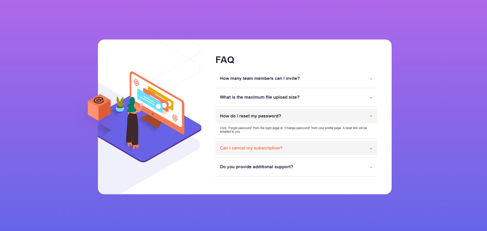

# Frontend Mentor - FAQ accordion card solution

This is a solution to the [FAQ accordion card challenge on Frontend Mentor](https://www.frontendmentor.io/challenges/faq-accordion-card-XlyjD0Oam). Frontend Mentor challenges help you improve your coding skills by building realistic projects. 

## Table of contents

- [Overview](#overview)
  - [The challenge](#the-challenge)
  - [Screenshot](#screenshot)
  - [Links](#links)
- [My process](#my-process)
  - [Built with](#built-with)
  - [What I learned](#what-i-learned)
  - [Continued development](#continued-development)
  - [Useful resources](#useful-resources)
- [Author](#author)

## Overview

### The challenge

Users should be able to:

- View the optimal layout for the component depending on their device's screen size
- See hover states for all interactive elements on the page
- Hide/Show the answer to a question when the question is clicked

### Screenshot

### Links

- Solution URL: [Add solution URL here](https://your-solution-url.com)
- Live Site URL: [Add live site URL here](https://your-live-site-url.com)

## My process

### Built with

- Semantic HTML5 markup
- CSS custom properties
- Vanilla JavaScript

### What I learned

-Got a better understanding of CSS custom properties
-Learned how to structure the different containers in a HTML document

### Continued development

-improving on workflow

### Useful resources

- [W3 Schools](https://www.w3schools.com/) - This helped me at finding a few ways of implementing CSS and a few of its functionalities.

## Author

- Website - [Codrin Carpovici]() //ADD SITE
- Frontend Mentor - [@CodrinCarpovici](https://www.frontendmentor.io/profile/CodrinCarpovici)
- GitHub - [@CodrinCarpovici](https://github.com/CodrinCarpovici)
